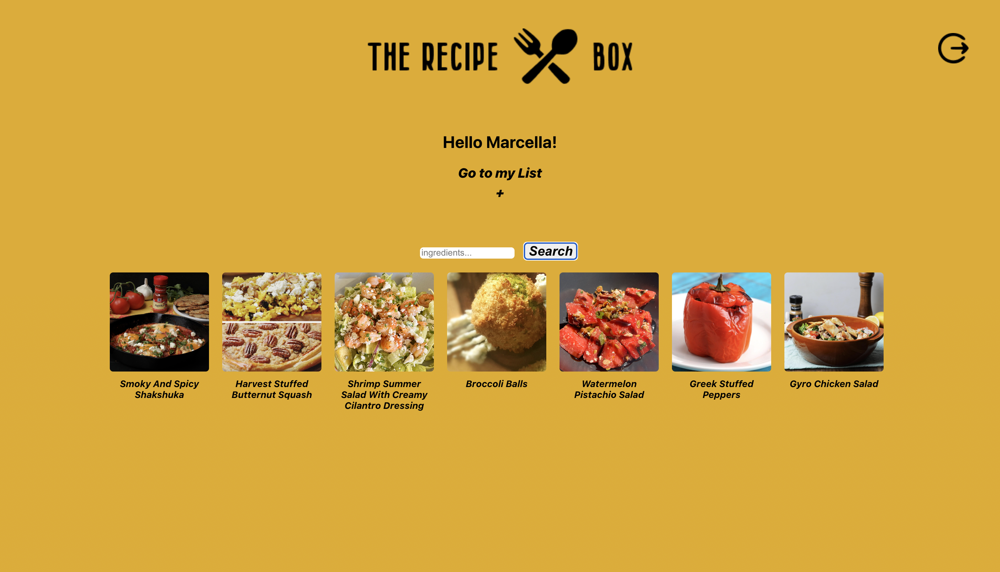
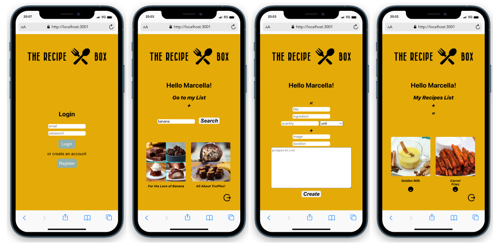

# The-Recipe-Box

The-Recipe-Box is a recipe finder tool. Users can register and sign in. Using the Tasty API The Recipe Box returns a list of recipes based on ingredients. Users can post new recipes in a private list.

## Screenshots

<p align="center">
  
  
</p>


## Getting started

1. Clone the repo

```
git clone https://github.com/marjory23/The-Recipe-Box.git
cd The-Recipe-Box
```

2. Install dependencies in both /my-app and /server folders
```
npm install
```

3. Start development server
```
cd /Server
nodemon index.js
```

4. Start the front end app
```
cd /my-app
npm start
```


## Built with

* [React](https://reactjs.org) - Front end library for building user interfaces
* [Express JS](https://expressjs.com) - Web framework for Node.js
* [MongoDB with Mongoose](https://www.mongodb.com) - NoSQL database management system


## Author

Marcella Baldo - [Github](https://github.com/marjory23) - [LinkedIn]()

